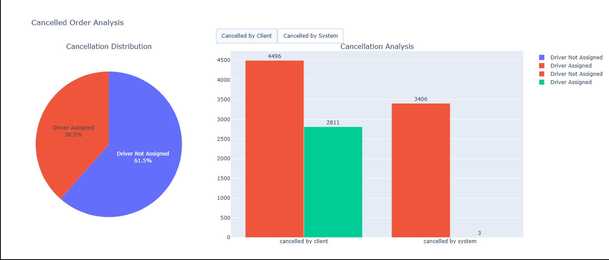
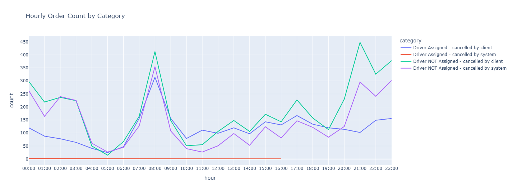
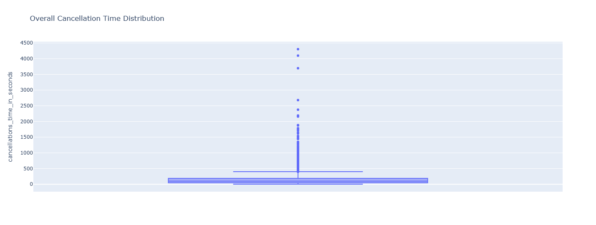
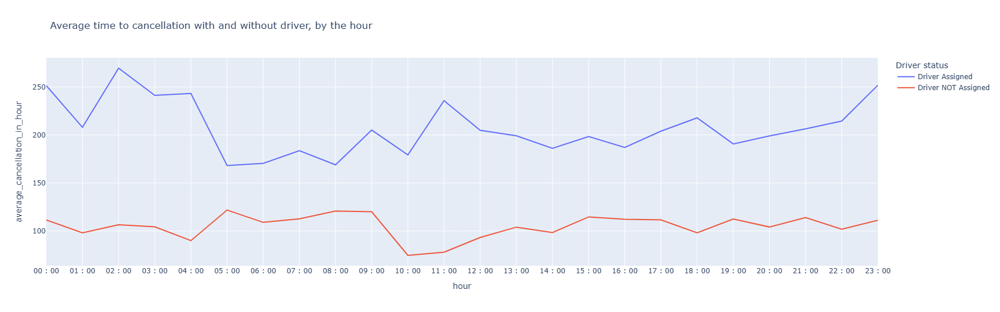
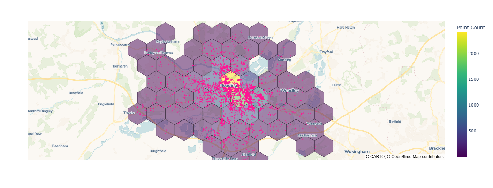

# Key Insights & Visualizations

### Prerequisites

Install the following Python packages before running the project:

* `marimo`
* `polars`
* `plotly`

## Based on the analysis the Driver not assigned cancellation occuring more in the system 
- cancelled by the system happend 99.99% - 3406
- cancelled by Client happend 61.5 % - 4496

  

## Based on the trending line chart
 -  Driver NOT assigned and cancelled by client has the max trending line 

## Based on  average time to cancellation with and without driver, by the hour
 - we have lot of outlier so we need to normalize the data set 
 
 - so i have remove the outlier where 99.5 percentage of teh distribution is covered under the less than 1000 so based on the observation  applied this condition to remove the outliers
 

 ## calculate how many sizes 8 hexes contain 80% of all orders from the original data sets and visualise the hexes, colouring them by the number of fails on the map
  - As per the observe teh reading area has the max population of the request 2418
  
