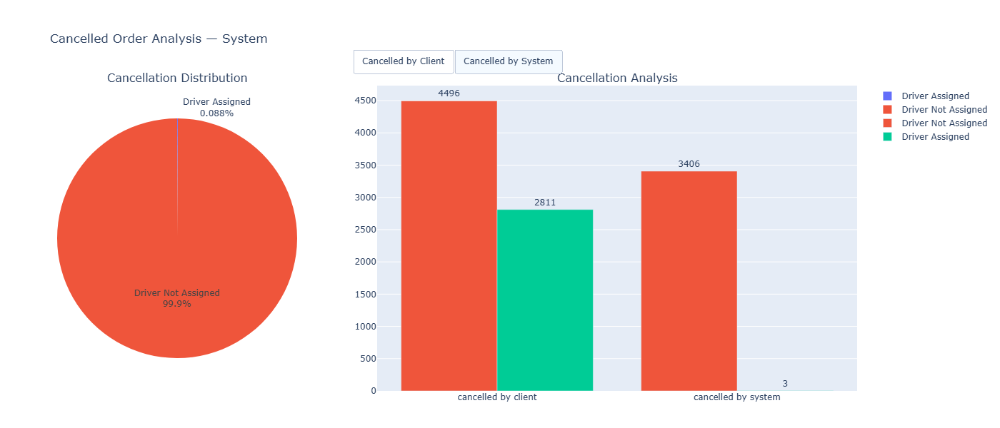

# Key Insights & Visualizations
Based on the analysis the Driver not assigned cancellation occuring more in the system 
- cancelled by the system happend 99.99% - 3406
- cancelled by Client happend 61.5 % - 4496

  
